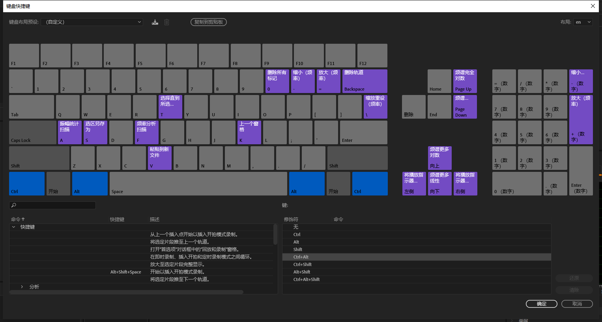

# 摸鱼指南与作业总结

---

## 探索新软件的方法

看着你们什么都不会就莽上去的可爱样子我真的是着急，~~像极了当年我们的社长~~。为了不让你们莽到头破血流，那这次我就教教你们怎么去科学地去摸一个软件。

---

* ### 鼠标滚轮

  一般来说**鼠标滚轮**在软件中起到一个方便**导航**与**查看**的作用，说简单点就是你们的脖子，让你们能左转右转概览全局。

导航就是从一点到另一点，查看就是看得清与看不清。

而操作一个软件这两个操作是相当重要的且频率极高的。所以，在探索一款新的软件的时候，首先要探索的就是鼠标滚轮与各个操作键——**<kbd>Ctrl</kbd>、<kbd>Shift</kbd>、<kbd>Alt</kbd>、<kbd>Ctrl</kbd>+<kbd>Shift</kbd>、<kbd>Ctrl</kbd><kbd>Alt</kbd>……**等等与鼠标滚轮一起使用会有什么样的效果。

顺带一提，大部分软件是无法修改软件中的鼠标滚轮的作用的。

除了Reaper。

> MouseWheel是鼠标滚轮的英文

只有掌握了导航和查看相关的大部分快捷键，看得清了也能指哪儿打哪儿了，你的操作才会更有效率，鼠标才会有更大的价值。

* ### 快捷键设置

这一点实名批评一下巨硬的OneNote。大家可以试着去找一下OneNote有关修改快捷键的教程，大部分教程都会告诉你，你的快捷键只能设置成<kbd>Alt</kbd>+<kbd>12345...</kbd>,想要脱离鼠标就得去背他们本家的快捷键表，~~果然Office是给没有什么搞机欲望的人准备的。~~就莫得灵魂。

v
一般来说在菜单栏里翻翻找找总是能找到快捷键设置的。如果找不到该怎么办呢？

百度一下，~~你还是不知道OneNote怎么设置快捷键~~

为什么我一直强调快捷键设置的重要性呢？因为在快捷键设置中你总会找到陌生的词汇，~~这时候你会为自己的中文词汇量而发愁，进而对自己的国籍产生怀疑对人生产生厌倦对生活充满惆怅~~，而查找这些陌生词汇，并动手去体验相应的操作的过程往往会极快地让你对这个软件的功能有一个快速的大体的认知。

而动手去修改那些高频使用率或者别扭的一批的快捷键（比如Audition的Ctrl+K我就改成了X）也可以让你更容易地去提高自己的使用效率，同时你也不用在嘴上记住快捷键而是在手指上"记住"它们。

最后就是记不起完成相应操作应该按下什么按键的时候，你不需要打开搜索引擎去搜索，而是会打开快捷键设置，搜索相应的操作；如果你完成某一项任务时脑内响起"这样做太麻烦了"，你也可以打开快捷键设置，搜索相应的关键词，你可能会发现更加高效率让你相见恨晚的快捷键。

这一点在Reaper中体现的淋漓尽致。Moy在他的专栏中这样描述：

> ​	在 Reaper 实际的使用过程中，经常会有「本来只是想要最基础的一架纸飞机，结果赫然在 Action List 中翻出了 7 台隐形昆式战斗机和 5 架高达外加一颗死星」这样的事情发生。

Reaper的快捷键设置（Action List）只需要在键盘上按下"？"。当我想要找有关快速**选择（select）**多个**音频块（items）**的指令时， 我只需要在Action List的搜索框中输入这两个关键词，就会有一大群可供使用的指令供我查阅。

同样的，在Au中我们也可以做这样的操作。

Au的快捷键设置是为数不多能让我觉得心服口服的界面。它直观又易于修改，不管按下什么键，都可以在键盘图上看到接下来继续按下什么键会发生什么事。~~如果能够改掉鼠标滚轮的操作那就再好不过了~~

同样我们在搜索栏输入关键词`选择 剪辑`（音频块在Reaper中叫”Item“，在Au中叫“剪辑”），在搜索结果中也出现了许多可供我们使用和修改的操作。~~只是没有Reaper多还没有Reaper好用~~

以这样的思路，我们可以了解一下这款软件其他元素都有什么样的名字，以便日后有进阶的操作需求时能够方便地搜索并修改。

* ### 会摸就多摸点

> ~~这个标题其实不怎么贴切但是足够滑稽所以我就这样写了~~

完成以上两步，我们在这款软件的初步探索就可以完成了。各位可能要说了，讲了这半天，软件这么大的地盘我还搞不懂嘞一头雾水嘞。

`那有时间就摸一摸啊。这里点一点那里点一点都看看是什么效果嘛。`

`对于我们的音频软件就更是这样了。没有素材那就自己录几段素材，没有基础那就瞎jr乱搞一通吧。对着菜单栏里面的所有操作都摸一遍，怎么着我也是个小神通了8.`——暴躁老哥量子猫

咳咳，我们赶走这位暴躁老哥，正经来给大家讲一下音频软件下一步怎么摸的思路。

首先要摸的是**窗口（View）**菜单。

我们还是以Au为例来摸一下。

在Audition的菜单栏点击窗口菜单，我们可以看到有那么几项是打了对勾的。

这个菜单能够给你一个直观的有关这个软件界面的印象。而在你调取这些窗口的过程中，你也会发现一些之前没有预料到的这个软件的新天地。同时，调整适合自己的界面布局也是为了方便自己工作，让自己玩起软件的时候看得更顺眼。

> 而我在这里就~~又要吹一波Reaper，它能改皮肤（Theme）！~~Au它做～不～到～~~

而有一些还跟着<kbd>Alt</kbd>+<kbd>1</kbd>之类的神秘代码。那我们就把对勾去掉好了，比如这个很眼熟的“编辑器”。

点击去掉对勾之后，我们发现，au窗口中原本中间最大的那一个方块缺了一角，只剩下一个孤零零的混音器：

`																						↓↓↓↓`

再按下<kbd>Alt</kbd>+<kbd>1</kbd>那一角便又恢复了原样。

---

* ### 多看看教程

上面的这些操作呢，大都是我在看完教程之后结合工作而总结出来的一些~~不怎么~~实用的小操作。但是这些小把戏实际上并不能很快地让你掌握一款软件，只是在熟悉了另一款类似的软件之后对新软件进行探索时可以使用的路线。而对于你们这些小萌新来说，如果你真的跟着上面的做了一遍，其实你也发现了，你只是掌握了零零碎碎的一些知识点，没有真正搞明白这个软件的正确使用方法。所以，最重要的还是，

#### ***多看教程***

网络上的视频或是文本教程需要你们去实践，去操作，需要腾出时间来做。但我们身处一个最好的时代，有大批优秀的视频主或是其他大手子为大家提供了深入浅出的指导。而我作为引路人能做的最多的其实就是节省你们找各种教程的时间，让你们能更快地上手软件，同时给你们解答疑惑。但万丈高楼平地起，如果没有看过这些教程，要做事的时候才开始“莽”，那是万万不可取的。

在此我又一次贴出那些我总结出来的各种软件的相关教程，并给大家提供一个学习路径。

#### [1. doyoudo的audition教程](https://www.bilibili.com/video/av4444053/)

doyoudo是我看过的教程类UP主里面给我印象最深刻的一个。其中主讲Audition的是赵阳光老师。他的声音超好听，Au教程也不拖泥带水全程干货，推荐大家作为**入门教程**。

快看，快去看！

> 点这根雪糕doyoudo的bilibili空间，他们还有很多有趣的教程！

#### [2. davinci resolve 16官方教程](https://b23.tv/av60923339/p1)

Davinci Resolve是我一直推荐新手使用的一款剪辑软件。下载安装使用全程免费。而生产这款软件的黑魔法公司更是不遗余力地为软件本地化尽心尽力，不仅将软件汉化，还通过视频的方式给大家做了官方教程。除此之外，他们还免费翻译了软件的几本官方高质量教程。

达芬奇与大众流行的剪辑软件Premier不同。它不仅仅是一款剪辑软件。它包含**剪辑、特效、调色、音频处理**这几大模块，是一款全能的软件。推荐**想要从视频入手的同学**尝试学习。

#### [3. doyoudo的进阶audition教程](https://b23.tv/av4708802/p2)

咳咳，还是声音好听的阳光老师的课。

##### ***其实大家看完前面的教程和这一个教程之后，做消音视频就可以很轻松了。***

这个专题重点讲述的就是怎么样对视频做一个声音上的处理。而专题从第一集下载音效到最后一集模拟脚步声，详细地介绍了音效在Au中怎么为视频添色。强烈推荐大家把这些Doyoudo的au教程看完，你会有很多收获。

#### [4. Doyoudo的人声效果器教程](http://www.doyoudo.com/video/65)

没错还是doyoudo，它可以承包你从入门到放弃Au这款软件。

这个教程为原版为付费教程。但鉴于国际共产主义~~白嫖~~精神，我将视频下载并上传到了群文件中。在这里感谢nothing破费提供的账号。

> 观看时请注意序号顺序

这套教程原本是提供给歌曲后期的效果器教程，但是也可以作为大家使用音频软件的一些基本概念的入门。视频教程中详细地讲解了压缩器、延迟等效果器的原理以及用法，更难能可贵的是阳光老师还对一些轨道路由的相关知识做了图文并茂的解释。

#### ***强烈建议大家把这个系列教程作为对Au的最后一站，Au真的不是一个很好的多轨软件和录音软件，但可以作为一个很好的跳板。***

#### [5. reaper安利帖](https://www.zhihu.com/question/65865600/answer/244143880)

其实大家都知道我是各Reaper的狂热粉丝，甚至在Reaper交流群的群备注都是这样的。

~~这样不好，这样不好，大家不要学我。~~

而我之前就是看到了Moy的这篇安利帖死心塌地地成了Reaper的~~男人~~粉丝。它直击我这个Audition用户的痛点，对于忍受了很久的Audition贫弱多轨编辑能力的我来说，这无异于看见了天堂。

> 
>
> 毁灭一个人最简单的方法就是让他看见天堂。——~~挂科老狗~~量子猫

推荐大家在使用过Au一段时间之后看看这篇帖子。相信你也会像我一样充满了对天堂的向往并沉醉于Reaper温柔的怀抱中。

同时给正式使用Reaper同学们推荐这个全国最大的~~暴躁老哥~~音频大佬聚集地，也是全国最大的Reaper交♂流群：

#### [6. midisoft的翻译的reaper教程视频](https://b23.tv/av53064391)

上面的图是国外网友调侃式地讲述各种饮品软件的学习曲线。对于Reaper，第一个上升的阶段对应的节点是“Found Kenny(找到Kenny的视频）”。

Kenny 是Youtube上坚持做高质量Reaper教程的一个视频主。Reaper作为一个三天一小更五天一大更的软件，能够坚持不断制作相关的教程视频以及新功能介绍视频可以说是一件相当考验毅力的事情。但Kenny做到了。**通过他的视频，你可以快速掌握Reaper 的基本操作与进阶操作。**

而Midisoft这位Up主是致力于在国内推广Reaper的。他们定期更新翻译过的Kenny的视频。虽然进度很慢，但是大部分情况下足够使用了。而且，

这个群的老哥们说话好听，吹水有趣，又有问必答，我超喜欢这个群的（但建议大家决定进入Reaper的世界之后再去进群骚扰管理员）。

对于想要提高英语听力水平的同学又等不及Midisoft的龟速汉化的同学，可以翻墙到youtube瞻仰Kenny大神的原视频。

#### [7. 知乎专栏：reaper手册](https://zhuanlan.zhihu.com/reaper)

跟着这个你也能调教出自己的贤内助——~~Reaper的老公~~量子猫。

专栏作者Moy也是个声音超好听的大哥哥。他是一个游戏音效师，但是这个专栏的内容主要是为了给大家提供一些调教Reaper的方向。跟着这个专栏一步步走下去，你会沉沦于Reaper 的强大~~同化成量子猫形态~~。

1. #### 其他教程

   斗宗强者的恐怖如斯教程合集即将登陆我群。

   

   

   [歌曲后期乐理知识补课](https://b23.tv/av4500081/p1)：成为歌曲后期的基本功。

2. 你们要放到收藏夹里的一些资源网站[【冻鳗下载站】](https://nyaa.si/?f=0&c=0_0&q=%E8%BE%89%E5%A4%9C%E5%A4%A7%E5%B0%8F%E5%A7%90)[【磁力链接】](https://cn.bing.com/search?q=%E7%A3%81%E9%93%BE%E6%90%9C%E7%B4%A2&qs=n&form=QBRE&sp=-1&pq=%E7%A3%81%E9%93%BE%E6%90%9C%E7%B4%A2&sc=7-4&sk=&cvid=4D593688B489454CBC7FA27303DAAADF)[【国外电影站】](https://rarbgprx.org/torrents.php)[【哔哩哔哩视频下载ibilibili】](https://ibilibili.com/xiazai.php)[【录屏obs】](https://obsproject.com/)

## 作业总结

上次作业大家完成得并不是很精彩，看得出来大家为了赶作业操碎了心，我也为自己不能时时刻刻陪伴在你们身边为你们解答而捶胸顿足。但是很显然你们大部分都还没有看过教程就开始上手操作，所以我来为大家一一解答一下各位在作业中经常出现的那些问题。

1.  #### 画面与声音不同步

这个问题其实很好解决。重点是要了解一下键盘的上下左右键一般在剪辑软件中都是用来做什么的。

在audition中，键盘的左右键可以操控时间指针的左右移动。而将视频放入Au中之后，键盘的⬅️➡️键就可以在视频中一帧一帧地去寻找关键画面。

> 帧是视频画面的基本单位。一般来说，视频的连续画面都是由一个一个静止的图像组成的，那么一帧就是一个画面，⬅️➡️键就可以对画面进行精确定位了。

找到相应的画面，我们就可以很方便地把音效拖动到动作发生的起始点，从而解决画面与声音不同步的问题。

而如果我们找到的音效太长或者太短的话，也会造成画面与声音的不匹配。这时候我们有两种选择。

* ##### 裁剪音效

裁剪音效的操作这里就不细讲了。

这里只说裁剪之后解决声音突然去世的方式。

  1. 加淡出:看完教程你会明白的。
  
  2. 加混响

  有时我们需要让声音或者音乐在结束之后有一种意犹未尽的效果，或者淡出效果处理之后仍然突兀，这时候就需要我们搞一点有意思的东西了。

混响就是我们要搞的有意思的东西。

根据我们小学的物理知识，在宿舍里你不会听到自己声音的回响，话说完了，声音就消失了；但在大礼堂这样的巨大空间中，声音并不会在你讲话停止后结束，你仍然能听到自己的声音在大厅里回荡。这种在声音结束之后"余音绕梁"的效果就叫混响。混响经常被用来给声音制造空间感，给声音一种"湿"的感觉。而在这里，我们将用混响加包络线的方式来达成"意犹未尽"的效果。

混响的原理你可以在群内的doyoudo效果器教程里找到相应的视频观看。

这个方式我会先讲在Reaper中的实现方法。~~因为在Au里实现太复杂了而且Doyoudo讲过。~~

1. 在Reaper中，点击音效音频块（item）上的FX按钮，打开item fx窗口，

   

   > 如果找不到FX按钮，可以看一下[这篇文章](https://zhuanlan.zhihu.com/p/51682487)。

2. 在窗口中找到Category（类别）下的Reverbate（混响）。

   

3. 添加一个适合的预制，比如Live Vocal；

4. 将**Wet**推子拉到大约-16.

5. 点击音频块上的（包络按钮），在弹出的窗口中选择**Wet**。

6. 这时音频块的底部会出现一条彩色的线。我们将鼠标移动到这条线上按住<kbd>Ctrl</kbd>时，鼠标会变成一根笔的形状，这表明我们可以对这条线进行“绘画”操作。

   

7. 而我们要画的是在结尾上扬的曲线。

   

8. 如法炮制5-7步，我们给**Dry**画一条在结尾向下的曲线。

   

   > 不要在意这凄惨的画工！

   

* ##### **伸缩音效**

  在Reaper中，伸缩音效只需要按住<kbd>Alt</kbd>在音频块边缘拖动就OK。

  

  而在Au中，你需要先这样打上对勾：

  

  而后拖动音频块右上角的白色小三角：

  

2. 音效重复

   其实音效包里是有很多备选`Voice1 Voice2 Voice3`的，比如：

   

   为了避免重复，可以乱序使用这些备选音效的。

3. 寻不见音效：这个就得积累单词量和音效库体积了。

4. bgm不会下刀

   其实这种事，需要你了解一下Au的频率频谱显示器。

   

   看见这一条条的竖线（分界线）了吗？这些都是音乐的节奏点。如果觉得自己下刀总是不准确，可以双击音乐文件进入音频处理界面。点亮左上角的图标没错就是那个蓝色的小图标。那之后打开频率频谱显示器。

   鼠标点击竖线上方的波形，将时间指针放置到竖线上，然后按下M打下标记。

   

   接下来按<kbd>1</kbd>来回到多轨界面，可以看到音频块相应位置有了一道道虚线。这时候只需要对着虚线下刀违和感就会小很多。

   

   
